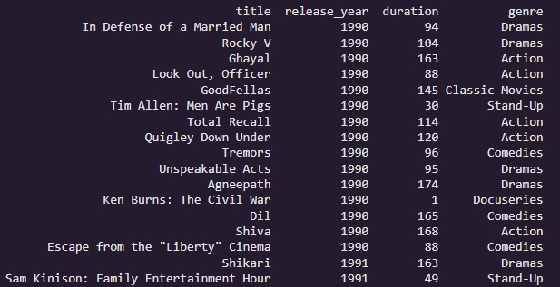
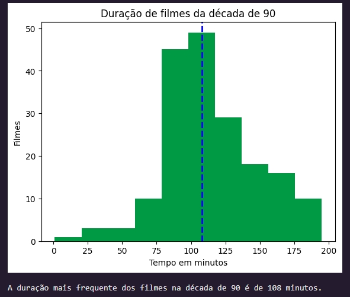
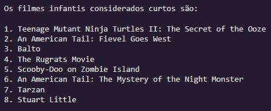

## *Mergulhando no Cinema dos Anos 90 na Netflix: Uma Viagem Curta e Agradável* 🎬

Este dataset é um portal para o catálogo de filmes da Netflix, com foco especial nos anos 90. Ele nos permite explorar uma variedade de gêneros, durações e descrições, além de saber quando cada filme chegou ao streaming.

_O dataset possui 4812 linhas e 11 colunas_

## **Desvendando os Dados 🔍** 

* Começamos filtrando o dataset para incluir apenas os filmes lançados entre 1990 e 1999. Isso resultou em um conjunto de 184 filmes, prontos para análise..

## **A Duração Ideal: Explorando a Mediana 📊**

* Para entender a duração média dos filmes dos anos 90, calculamos a mediana. O gráfico resultante nos revelou que a maioria dos filmes dessa época tem uma duração próxima a 100 minutos.

## **Escolha Sua Aventura: 7 Filmes para Maratonar 📽**

* Agora, você pode mergulhar em uma seleção de filmes com durações consideravelmente menores, sem abrir mão da experiência cinematográfica dos anos 90.

Basta escolher o gênero que mais te agrada e embarcar em uma jornada rápida e envolvente!

Prepare a pipoca e aproveite! 🍿
