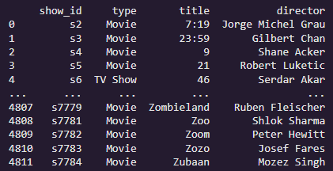

## *Investigando filmes na Netflix* 🎬

Este é um dataset do catálogo de filmes na Netflix, abordando vários gêneros de diversos anos, suas durações, descrições, assim como sua data de postagem no streaming. O objetivo deste dataset é apresentar apenas filmes da década de 90, apresentar a normalidade da duração desses filmes da época e citar os 7 filmes com uma duração razoavelmente baixa, para assistir sem ocupar muito na rotina.

_O dataset possui 4812 linhas e 11 colunas_

## **Filtrando colunas e modelando os dados ⚙** 

* Em primeiro lugar foi necessário o isolamento de colunas desnecessárias para o projeto e fateando para obter apenas filmes da década de 90, totalizando 184 linhas.

## **Normalidade da duração 📊**

* Ao calcular a mediana, foi gerado o gráfico a seguir para melhor visualização, destacando o valor desejado para obtermos a mediana da duração dos filmes nesta época.

## **Filmes consideravelmente curtos 📽**

* Por fim, podemos escolher o gênero de preferência para obter uma pequena lista de filmes para assistir de curta duração.

